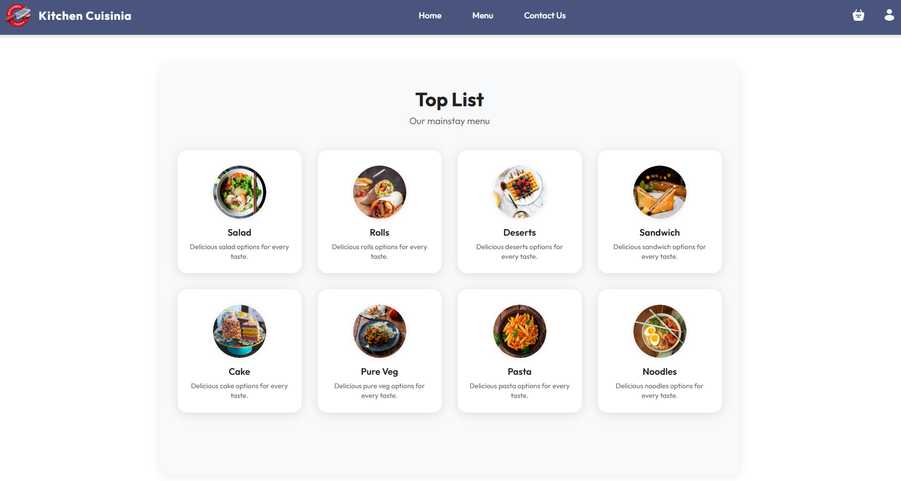
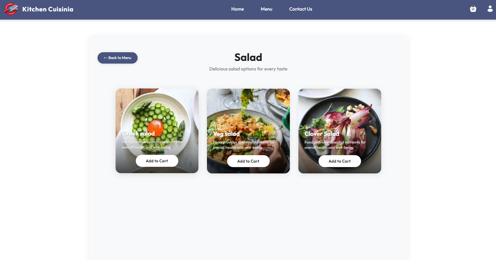
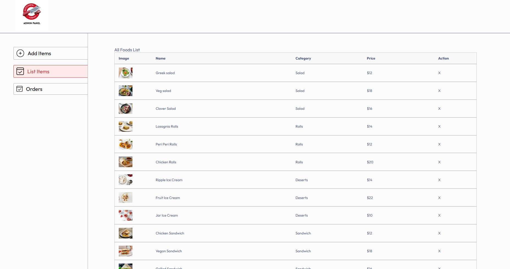

<a name="top"></a>

<h1 align="center">Kitchen Cuisinia 🍽️</h1>


## Project Preview

<table>
  <tr>
    <td>
      <a href='./menu.png'></a>
    </td>
    <td>
      <a href='./cart.png'></a>
    </td>
    <td>
      <a href='./items.png'></a>
    </td>
  </tr>
</table>

## About Kitchen Cuisinia


**Tech Stack:**  
<kbd>[React.js](https://react.dev/)</kbd>, <kbd>[Node.js](https://nodejs.org/)</kbd>, <kbd>[Express.js](https://expressjs.com)</kbd>, <kbd>[MongoDB](https://www.mongodb.com)</kbd>, <kbd>[Tailwind CSS](https://tailwindcss.com/)</kbd>

---

## ✨ Features

### 🔧 Backend

- 🗄️ MongoDB Integration
- 🔐 JWT Authentication
- 🔒 Protected API Routes
- 🛒 Cart Management
- 🍽️ Food Menu & Categories
- 📦 Order Management
- 👤 User Profile & Preferences
- 📊 Order History
- 📝 Feedback Collection

### 🌐 Frontend

- 📋 Signup & Login UI
- 🔑 Authentication Flow
- 🛒 Cart Page
- 🥗 Menu & Category Pages
- 📱 Responsive Design
- 🏠 Landing Page
- 🧾 Order Placement & Success
- 📦 Orders Page
- 💬 Contact Us (Footer)
- 🌐 Deployment Ready

---

## 🗂️ Folder Structure

```
(Root)
├───backend
│     ├───config
│     ├───controllers
│     ├───middleware
│     ├───models
│     ├───routes
│     ├───utils
│     ├───app.js
│     ├───package.json
│     └───package-lock.json
│
├───frontend
│     ├───public
│     │    └─ ...assets, videos
│     ├───src
│     │     ├───components
│     │     ├───context
│     │     ├───pages
│     │     ├───assets
│     │     └───index.css
│     ├───index.html
│     ├───package.json
│     └───package-lock.json
│
├───admin
│     ├───src
│     │     ├───components
│     │     ├───pages
│     │     └───App.jsx
│     ├───package.json
│     └───package-lock.json
│
├───preview
│     └───...screenshots
│
├───README.md
```

---

## ⚙️ Environment Variables

### Backend (`backend/.env`)

```env
MONGODB_URI=your_mongodb_uri
JWT_SECRET=your_jwt_secret
FRONTEND_URL_SIMPLE=http://localhost:5173
FRONTEND_URL_ADMIN=http://localhost:5174
FRONTEND_URL_SIMPLE_PRODUCTION=https://your-frontend-url.onrender.com
FRONTEND_URL_ADMIN_PRODUCTION=https://your-admin-url.onrender.com
PORT=3000
```

### Frontend (`frontend/.env`)

```env
VITE_API_URL=http://localhost:3000
VITE_API_URL_PRODUCTION=https://your-backend-url.onrender.com
```

### Admin (`admin/.env`)

```env
VITE_API_URL=http://localhost:3000
VITE_API_URL_PRODUCTION=https://your-backend-url.onrender.com
```

---

## 🚀 Quick Start Guide

### 1. Clone the Repository

```bash
git clone https://github.com/your-username/kitchen-cuisinia.git
cd kitchen-cuisinia
```

### 2. Install Dependencies

```bash
npm install
cd backend && npm install
cd ../frontend && npm install
cd ../admin && npm install
```

### 3. Set Up Environment Variables

- Create `.env` files in `backend`, `frontend`, and `admin` folders as shown above.

### 4. Run the Project in Development

**For Windows:**

```bash
npm run dev
```

**For Mac/Linux:**

```bash
npm run dev
```

This will start both backend and frontend (and admin if configured) in development mode.

### 5. Build for Production

```bash
npm run build
```

---

## 📝 Additional Notes

- Make sure MongoDB is running and accessible via the URI you provide.
- The
